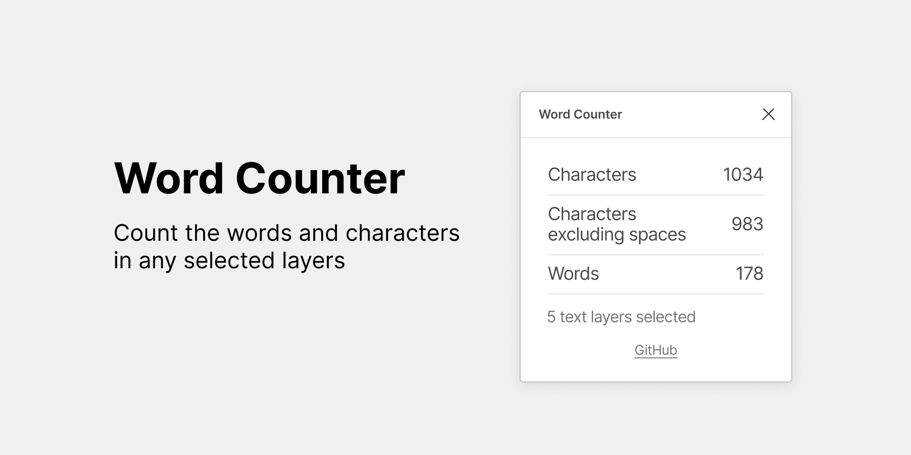

# Word Counter
Figma Plugin - Count the words and characters in any selected layers.

## Built Instructions
* Run `yarn` to install dependencies.
* Run `yarn build:watch` to start webpack in watch mode.
* Open `Figma` -> `Plugins` -> `Development` -> `New Plugin...` and choose `manifest.json` file from this repo.
